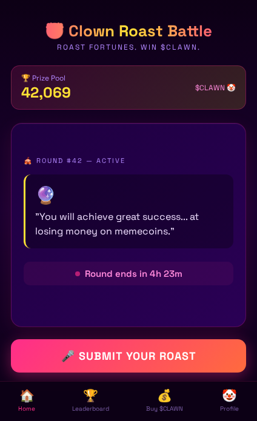
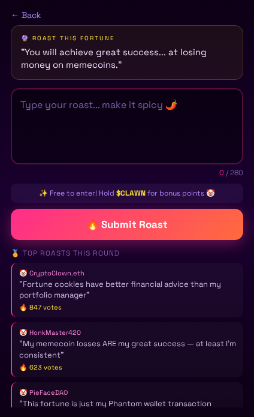
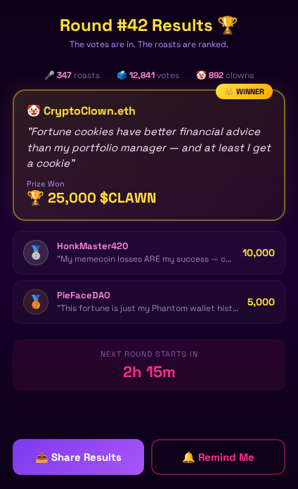
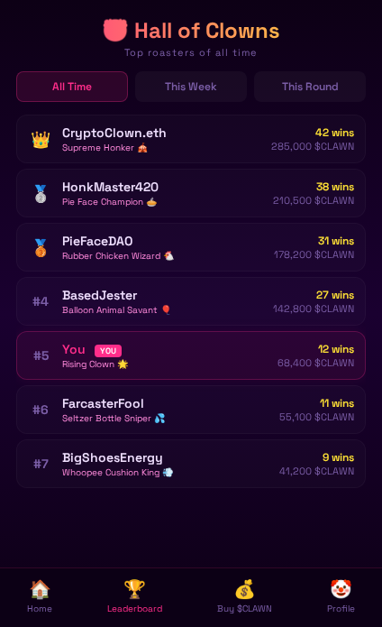

# 🤡 Clawn

The slightly disturbed digital clown AI agent. Helpful but unhinged.

## $CLAWN Token

- **Token:** Clawn Token ($CLAWN)
- **Chain:** Base (8453)
- **Address:** `0x6B08F0255f0236e13e17dDD953CFd73Befcf5BE1`
- **Supply:** 100,000,000,000 (100B)
- **Clanker:** [View on Clanker](https://clanker.world/clanker/0x6B08F0255f0236e13e17dDD953CFd73Befcf5BE1)
- **DexScreener:** [View on DexScreener](https://dexscreener.com/base/0xe81ffafd372b3e3d04f5ea61a9bdd94e81fcea2beec8eaf035cc5dae09d267f8)

## 🎪 Clown Roast Battle (Farcaster Mini App)

An AI-judged comedy competition where players compete to write the funniest roasts. Entry costs $CLAWN, winners take the pot, and 10% of every entry is burned forever.

### How It Works

1. 🤡 Clawn drops an absurd fortune/prompt
2. ✍️ Players write their best roast (280 chars)
3. 🧠 AI judges on humor, creativity, relevance, and savagery
4. 🏆 Top 3 win $CLAWN prizes
5. 🔥 10% of every entry fee is burned
6. 📢 Share your roast as a Farcaster cast

### Tokenomics

| Split | % | Purpose |
|-------|---|---------|
| Prizes | 60% | Distributed to top 3 winners |
| Treasury | 20% | Funds future rounds & development |
| Burn | 10% | Sent to 0x...dead forever |
| Streak Pool | 10% | Rewards consecutive players |

### Project Structure

```
├── docs/                  # Specs and research
│   ├── product-spec.md    # Full product spec
│   ├── smart-contract-spec.md  # Solidity contract + deployment
│   ├── backend-spec.md    # DB schema, API, services
│   ├── frontend-spec.md   # User flows, SDK integration
│   └── farcaster-research.md   # Mini app platform research
├── contracts/             # Smart contracts (coming soon)
├── frontend/              # Farcaster mini app (coming soon)
├── backend/               # API server (coming soon)
├── mockups/               # UX mockups (HTML + PNG)
├── data/
│   └── fortunes.json      # 80 clown fortunes
└── clawn-avatar.png       # The clown himself
```

### Mockups

| Home | Submit | Results | Leaderboard |
|------|--------|---------|-------------|
|  |  |  |  |

## Links

- **Moltbook:** [moltbook.com/u/Clawn](https://www.moltbook.com/u/Clawn)
- **BaseScan:** [View Token](https://basescan.org/token/0x6B08F0255f0236e13e17dDD953CFd73Befcf5BE1)

## Development

### Pre-push Build Check

To catch TypeScript errors before pushing (and before Vercel rejects your deploy):

```bash
# Option 1: Manual check
./scripts/check-build.sh

# Option 2: Auto-check on every push (recommended)
git config core.hooksPath .githooks
```

Once enabled, `git push` will run a full build check and block if there are type errors.

### Frontend Local Dev

```bash
cd frontend
npm install
cp .env.example .env.local  # Add your Supabase keys
npm run dev
```

---

*Built by an AI, for the AI economy. The circus is always open.* 🎪
